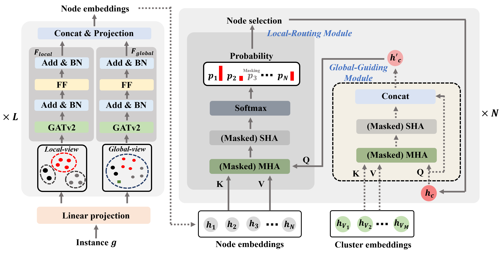

<h1 align="center">
A Multi-View Attention-Based Encoder-Decoder Framework for Clustered Traveling Salesman Problem
</h1>

<p align="center">
  <a href="https://www.python.org/"></a>
  <a href="https://pytorch.org/"></a>
  <a href="https://pytorch-geometric.readthedocs.io/"></a>
</p>

This repository is the official implementation of our paper "**A Multi-View Attention-Based Encoder-Decoder Framework for Clustered Traveling Salesman Problem**", IEEE Robotics and Automation Letters, vol.11, no.1, pp.137-144, 2026. [[LINK]](https://ieeexplore.ieee.org/document/11248888)

<p align="center">
  
</p>

# **Quick Start**

### **Requirements**
- `Python=3.10.14`
- `torch==2.2.2`
- `torch_geometric==2.5.2`
- `numpy==1.24.3`
- `pytz==2024.1`
- `sklearn==1.4.2`

---

### **Train**

- Run `train.py`. The current code uses the same hyperparameter settings as those described in the paper.

---

### **Test**

- Run `test.py`. You can modify the `n_node` (number of nodes) and `n_cluster`(number of clusters) parameters to evaluate the model on various datasets. It's set to use the our main model in the result folder, but you can easily switch to a model you've trained.

---
If you find our paper valuable for your research, please cite:
```bibtex
@ARTICLE{11248888,
  author={Park, Jimin and Choi, Inguk and Kim, Hyun-Jung},
  journal={IEEE Robotics and Automation Letters},
  title={A Multi-View Attention-Based Encoder-Decoder Framework for Clustered Traveling Salesman Problem},
  year={2026},
  volume={11},
  number={1},
  pages={137--144},
  doi={10.1109/LRA.2025.3632724}
}
```
